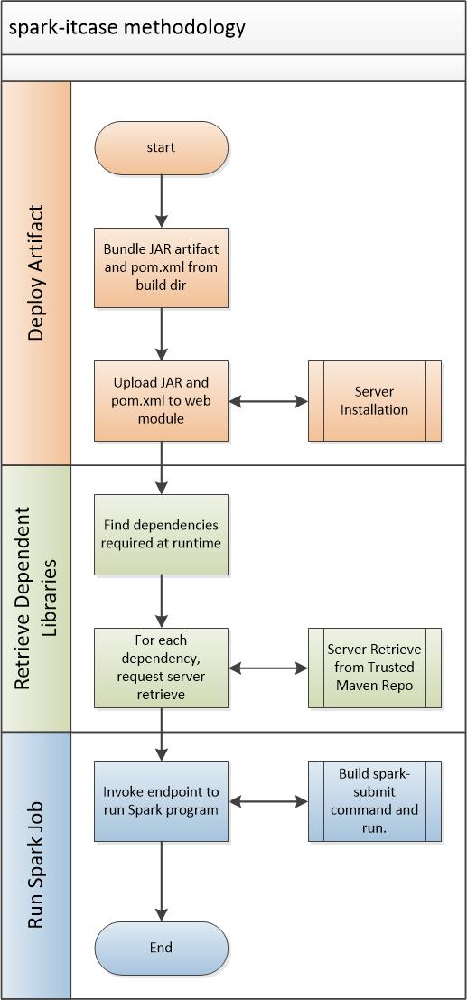

# spark-itcase
Maven plugin which will connect to a server module to run Spark programs remotely during development and integration builds. 

# Use Cases
The code here will satisfy the following use cases:
* Developers writing code on Windows based IDE's
* Developers writing code remotely from the cluster

# Goals
The spark-itcase project has the following high level goals:
* Reduce build cycle time for developers writing Java or Scala based Spark jobs built with Maven
* Reduce manual tasks required when running Spark jobs (transferring files,

# How Does it Achieve it's Goals?
* Runs the code during the Maven integration-test phase pre-commit 
* Minimize file transfer by only pushing the project artifact (without dependencies) to the server
* Automatically construct a spark submit invocation with all dependencies

# Methodology
The following diagram illustrates how the maven plugin interacts with the server module to deploy the artifact, retrieve dependencies then run the job remotely.

# Installation

## 1.) Server Installation
* Download the binary server from Maven (http://search.maven.org/remotecontent?filepath=solutions/deepfield/spark-itcase-web/1.0.0/spark-itcase-web-1.0.0-bin.zip)
* Unzip the file
* Modify the config in the "conf" directory
* Start the server (spark-itcase/bin/spark-itcase-server)

## 2.) Maven Plugin
Add the Maven plugin to your build like so:

~~~~
			<plugin>
				<groupId>solutions.deepfield</groupId>
				<artifactId>spark-itcase-maven</artifactId>
				<version>1.0.0</version>
				<executions>
					<execution>
						<goals>
							<goal>sparkItCase</goal>
						</goals>
					</execution>
				</executions>
				<configuration>
					<endpoint>http://YOUR_SERVER:10080/rest</endpoint>
					<!-- Proxy is optional -->
					<proxyHost>127.0.0.1</proxyHost>
					<proxyPort>3128</proxyPort>
					<classToRun>YOUR SPARK CLASS</classToRun>
				</configuration>
			</plugin>
~~~~

## 3.) Run Your Build
